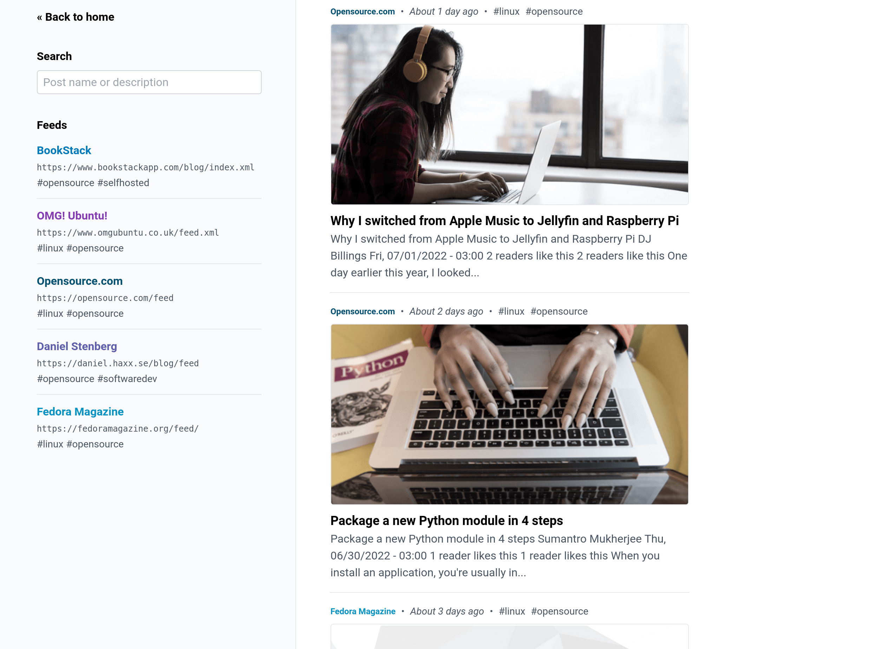

<!--
N.B.: This README was automatically generated by https://github.com/YunoHost/apps/tree/master/tools/README-generator
It shall NOT be edited by hand.
-->

# rss for YunoHost

[](https://dash.yunohost.org/appci/app/rss)    
[](https://install-app.yunohost.org/?app=rss)

*[Lire ce readme en français.](./README_fr.md)*

> *This package allows you to install rss quickly and simply on a YunoHost server.
If you don't have YunoHost, please consult [the guide](https://yunohost.org/#/install) to learn how to install it.*

## Overview

A simple, opinionated, RSS feed aggregator

### Features

The following features are built into the application:

- Supports RSS and ATOM formats.
- Regular auto-fetching of RSS feeds.
        Every hour by default, configurable down to 5 mins.
- Custom feed names and colors.
- Feed-based tags for categorization.
- 3 different post layout modes (card, list, compact).
- Fetching of page open-graph images.
- Feeds managed via a single plaintext file.
- System-based dark/light theme.
- Post title/description search.
- Mobile screen compatible.


**Shipped version:** 1.0.5~ynh1

**Demo:** https://demo.example.com

## Screenshots



## Disclaimers / important information

### Feed Configuration

Feed configuration is handled by a plaintext file on the host system. By default this configuration would be located in a `feeds.txt` file within the path `/home/yunohost.app/rss`.

The format of this file can be seen below:

```
https://feed.url.com/feed.xml feed-name #tag-a #tag-b
https://example.com/feed.xml Example #updates #news

# Lines starting with a hash are considered comments.
# Empty lines are fine and will be ignored.

# Underscores in names will be converted to spaces.
https://example.com/feed-b.xml News_Site #news

# Feed color can be set using square brackets after the name.
# The color must be a CSS-compatible color value.
https://example.com/feed-c.xml Blue_News[#0078b9] #news #blue
```

## Documentation and resources

* Official app website: <https://github.com/ssddanbrown/rss>
* Official admin documentation: <https://yunohost.org/packaging_apps>
* Upstream app code repository: <https://github.com/ssddanbrown/rss>
* YunoHost documentation for this app: <https://yunohost.org/app_rss>
* Report a bug: <https://github.com/YunoHost-Apps/rss_ynh/issues>

## Developer info

Please send your pull request to the [testing branch](https://github.com/YunoHost-Apps/rss_ynh/tree/testing).

To try the testing branch, please proceed like that.

``` bash
sudo yunohost app install https://github.com/YunoHost-Apps/rss_ynh/tree/testing --debug
or
sudo yunohost app upgrade rss -u https://github.com/YunoHost-Apps/rss_ynh/tree/testing --debug
```

**More info regarding app packaging:** <https://yunohost.org/packaging_apps>
