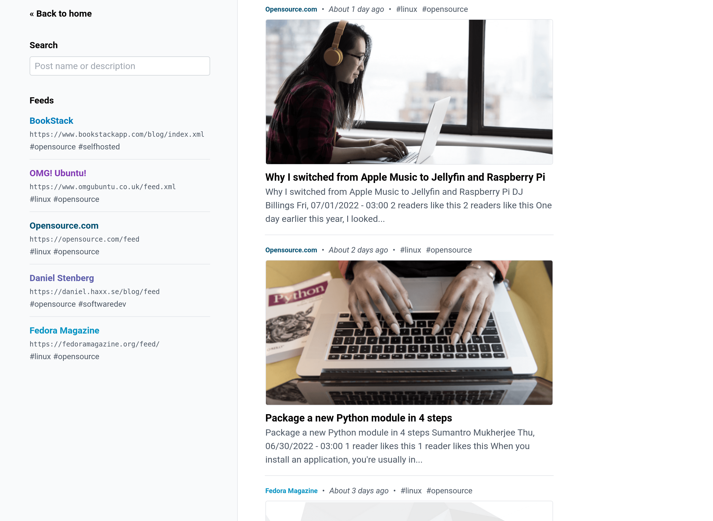

<!--
N.B.: This README was automatically generated by https://github.com/YunoHost/apps/tree/master/tools/README-generator
It shall NOT be edited by hand.
-->

# rss pour YunoHost

[](https://dash.yunohost.org/appci/app/rss)  

[](https://install-app.yunohost.org/?app=rss)

*[Read this readme in english.](./README.md)*

> *Ce package vous permet d’installer rss rapidement et simplement sur un serveur YunoHost.
Si vous n’avez pas YunoHost, regardez [ici](https://yunohost.org/#/install) pour savoir comment l’installer et en profiter.*

## Vue d’ensemble

A simple, opinionated, RSS feed aggregator

### Features

The following features are built into the application:

- Supports RSS and ATOM formats.
- Regular auto-fetching of RSS feeds.
        Every hour by default, configurable down to 5 mins.
- Custom feed names and colors.
- Feed-based tags for categorization.
- 3 different post layout modes (card, list, compact).
- Fetching of page open-graph images.
- Feeds managed via a single plaintext file.
- System-based dark/light theme.
- Post title/description search.
- Mobile screen compatible.
- Built-in support to prune old post data.

**Version incluse :** 1.1.0~ynh1

**Démo :** https://demo.example.com

## Captures d’écran



## Avertissements / informations importantes

### Feed Configuration

Feed configuration is handled by a plaintext file on the host system. By default this configuration would be located in a `feeds.txt` file within the path `/home/yunohost.app/rss`.

The format of this file can be seen below:

```
https://feed.url.com/feed.xml feed-name #tag-a #tag-b
https://example.com/feed.xml Example #updates #news

# Lines starting with a hash are considered comments.
# Empty lines are fine and will be ignored.

# Underscores in names will be converted to spaces.
https://example.com/feed-b.xml News_Site #news

# Feed color can be set using square brackets after the name.
# The color must be a CSS-compatible color value.
https://example.com/feed-c.xml Blue_News[#0078b9] #news #blue
```

## Documentations et ressources

* Site officiel de l’app : <https://github.com/ssddanbrown/rss>
* Documentation officielle de l’admin : <https://yunohost.org/packaging_apps>
* Dépôt de code officiel de l’app : <https://github.com/ssddanbrown/rss>
* Documentation YunoHost pour cette app : <https://yunohost.org/app_rss>
* Signaler un bug : <https://github.com/YunoHost-Apps/rss_ynh/issues>

## Informations pour les développeurs

Merci de faire vos pull request sur la [branche testing](https://github.com/YunoHost-Apps/rss_ynh/tree/testing).

Pour essayer la branche testing, procédez comme suit.

``` bash
sudo yunohost app install https://github.com/YunoHost-Apps/rss_ynh/tree/testing --debug
ou
sudo yunohost app upgrade rss -u https://github.com/YunoHost-Apps/rss_ynh/tree/testing --debug
```

**Plus d’infos sur le packaging d’applications :** <https://yunohost.org/packaging_apps>