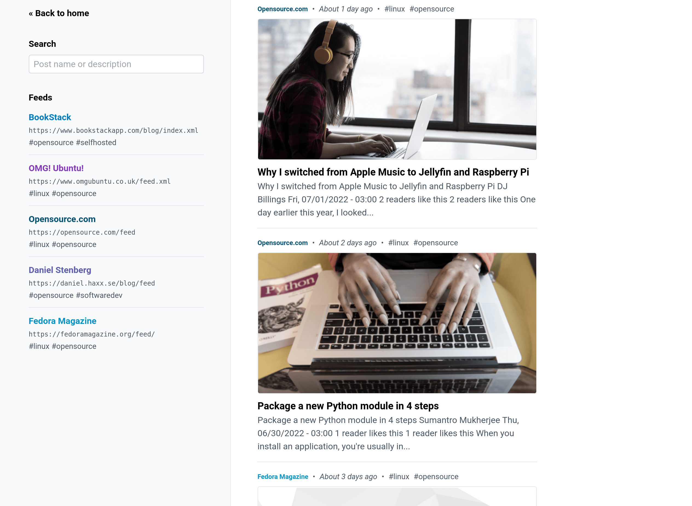

<!--
NB: Deze README is automatisch gegenereerd door <https://github.com/YunoHost/apps/tree/master/tools/readme_generator>
Hij mag NIET handmatig aangepast worden.
-->

# RSS voor Yunohost

[](https://ci-apps.yunohost.org/ci/apps/rss/)  

[](https://install-app.yunohost.org/?app=rss)

*[Deze README in een andere taal lezen.](./ALL_README.md)*

> *Met dit pakket kun je RSS snel en eenvoudig op een YunoHost-server installeren.*  
> *Als je nog geen YunoHost hebt, lees dan [de installatiehandleiding](https://yunohost.org/install), om te zien hoe je 'm installeert.*

## Overzicht

A simple, opinionated, RSS feed aggregator

### Features

The following features are built into the application:

- Supports RSS and ATOM formats.
- Regular auto-fetching of RSS feeds.
        Every hour by default, configurable down to 5 mins.
- Custom feed names and colors.
- Feed-based tags for categorization.
- 3 different post layout modes (card, list, compact).
- Fetching of page open-graph images.
- Feeds managed via a single plaintext file.
- System-based dark/light theme.
- Post title/description search.
- Mobile screen compatible.
- Built-in support to prune old post data.

**Geleverde versie:** 1.5.3~ynh1

## Schermafdrukken



## Documentatie en bronnen

- Upstream app codedepot: <https://github.com/ssddanbrown/rss>
- YunoHost-store: <https://apps.yunohost.org/app/rss>
- Meld een bug: <https://github.com/YunoHost-Apps/rss_ynh/issues>

## Ontwikkelaarsinformatie

Stuur je pull request alsjeblieft naar de [`testing`-branch](https://github.com/YunoHost-Apps/rss_ynh/tree/testing).

Om de `testing`-branch uit te proberen, ga als volgt te werk:

```bash
sudo yunohost app install https://github.com/YunoHost-Apps/rss_ynh/tree/testing --debug
of
sudo yunohost app upgrade rss -u https://github.com/YunoHost-Apps/rss_ynh/tree/testing --debug
```

**Verdere informatie over app-packaging:** <https://yunohost.org/packaging_apps>
